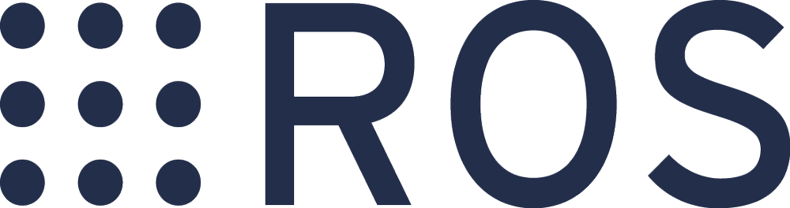

### Hi there 👋, I'm Chang Xu
### A Programmer 👨‍💻, my interests currently lie in Perception Tech, Embedded Software & Robotics.
+ 🌱 I'm currently learning CPS Security in Rust
+ 💬 Ask me about Embedded Software
+ ♊ More About Me: [Chang's Blog](https://xxchang.github.io/)
+ 📫 How to Reach Me: xuxchang@hotmail.com
+ 🛠️ Interests, Skills and Tools: 

  &nbsp
  &nbsp
  &nbsp
  &nbsp
  &nbsp
  &nbsp
  &nbsp  
  &nbsp
  &nbsp
  &nbsp
  &nbsp
  &nbsp
  &nbsp
  &nbsp
  &nbsp
  &nbsp
  &nbsp
  &nbsp
  &nbsp
  &nbsp
  &nbsp
  &nbsp
  &nbsp
  &nbsp
  &nbsp

<!--
**XxChang/XxChang** is a ✨ _special_ ✨ repository because its `README.md` (this file) appears on your GitHub profile.

Here are some ideas to get you started:

- 🔭 I’m currently working on ...
- 🌱 I’m currently learning ...
- 👯 I’m looking to collaborate on ...
- 🤔 I’m looking for help with ...
- 💬 Ask me about ...
- 📫 How to reach me: ...
- 😄 Pronouns: ...
- ⚡ Fun fact: ...
-->
